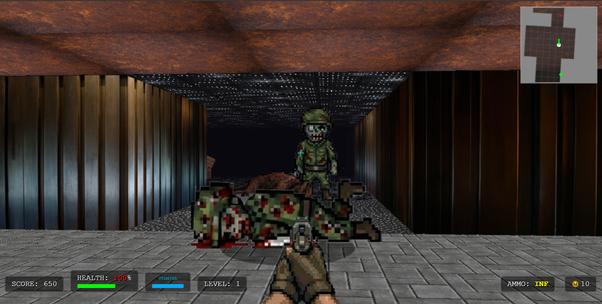
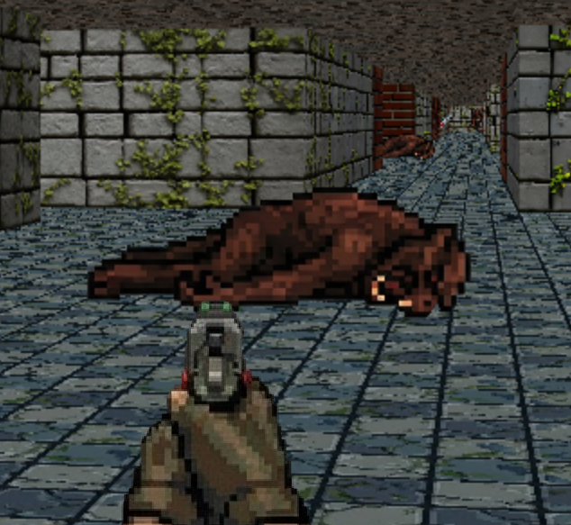
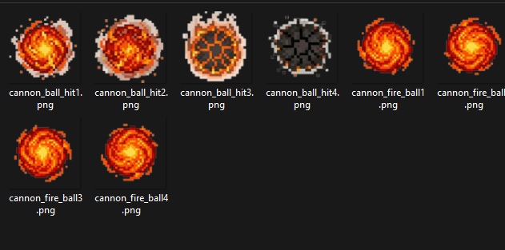
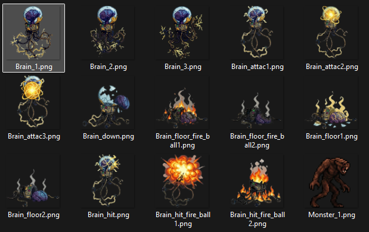

# Project RayCasting - V3

Juego FPS desarrollado con JavaScript, HTML y CSS, con un motor de raycasting y una aplicación de escritorio basada en Electron.

## Capturas del juego

Combate en primera persona, con minimapa e indicadores de salud, energía y munición.



Exploración de los escenarios y vista de un enemigo derrotado.



### Arte y sprites

Proyectiles de fuego y sus efectos de impacto.



Enemigos y distintos estados de sus animaciones.



## Ejecutar en Windows

Se requiere Node.js y npm.

### En el navegador

Desde la carpeta del proyecto, ejecutar:

```sh
node server.js
```

Abrir `http://localhost:8000`. También se incluye `Start_game.bat` para iniciar el servidor y abrir el navegador.

### Con Electron

```sh
npm ci
npm start
```

### Generar un instalador

```sh
npm run dist
```

La configuración de Electron Builder genera un instalador NSIS para Windows en `dist/`.

## Contenido

- `js/`: lógica del juego, raycasting, mapas, controles, audio y partículas.
- `css/`: estilos de la interfaz.
- `assets/`: imágenes, sonidos, música y video.
- `main.js`: punto de entrada de Electron.
- `server.js`: servidor HTTP para ejecución local.
- `tools/`: herramientas auxiliares del proyecto.

Esta copia conserva los archivos originales del proyecto. No incluye dependencias instaladas ni compilaciones generadas. La importación al repositorio no implica que se hayan ejecutado o probado el juego o su instalador.
